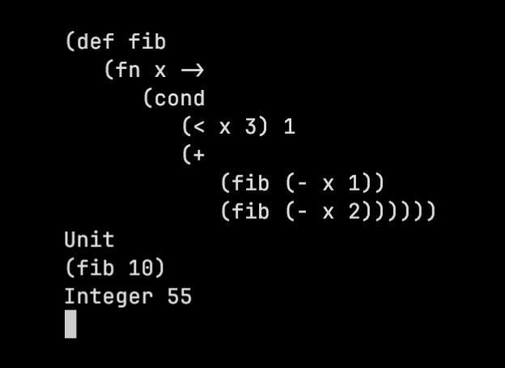
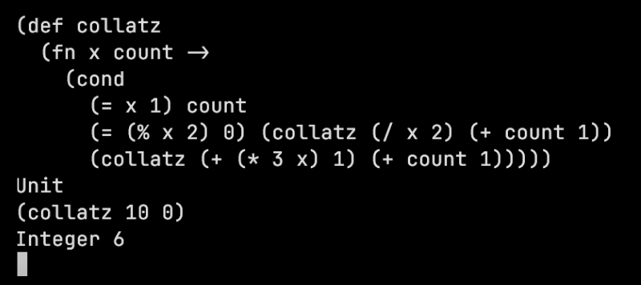

### Emmy
Tree-walking interpreter implementation of a LISP-type language implemented in OCaml. Toy project. Syntax inspired by Clojure. 

### Ongoing
---
Module system: 
- [x] File paths do not resolve correctly (currently need to import using relative or absolute path). Should instead be relative to the file passed to the interpreter imo.
- [ ] All names should be namespaced. Right now all source files are summed up into the same character stream, and without renaming, conflicts will occur.
- [x] Detect cyclic dependencies. Currently such cycles will result in an infinite loop.
- [ ] Enable importing specific definitions. Currently, only wildcard imports are possible (the entire source file is imported).
- [x] Currently, the top-level node is a Program node, that contains a list of expressions. To improve the module system, the Program node should instead contain a list of Namespaces, themselves containing a list of expressions. This way, we can reference different Namespaces. While the result will not be that different in terms of parsing, we will have a better internal representation of our program in the AST, and its probably better in the long run. With Namespaces as nodes in the AST, we can also have dedicated import nodes. Put the namespace list with the leaf dependency first, so that the context will build up as more and more namespaces are evaluated. 
- [ ] Having namespaces also mean I must have some sort of name analysis, perhaps it can be included into the alpha conversion? Need a way to lookup a definition within a module then.
- [x] ~~If dependencies are located in a nested directory, and the transitive dependencies are listed relative to that nested dir, files will not be found correctly.~~ The namespaces should be references by their position in the package i.e. "a.package.in.the.hierarchy". This will then be handled fine by the parser.
- [ ] Namespaces are loaded as many times as they are required. Should check whether the namespace is already loaded. If so, the dependent namespace needs to be evaluated after the dependee.

### Examples

`Calculate the nth fibonacci number`:

`Calculate the number of iterations before the Collatz equation reaches 1:`

#### Build:

`opam install --deps-only --with-test .`

#### Run REPL:

`dune exec emmy`

#### Run on source files:

`dune exec emmy ./examples/main.emmy`

#### Tests:
Testing is done with [alcotest](https://github.com/mirage/alcotest).

`dune runtest`

#### Debug:

`ocamldebug _build/install/default/bin/emmy`

`(ocd) info modules`

##### To set breakpoint: 

`break @ <module> linenumber`
